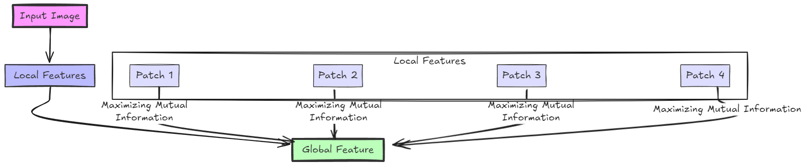
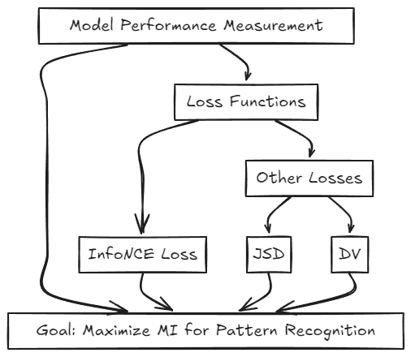
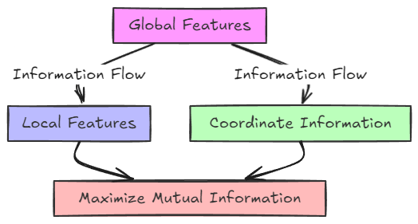
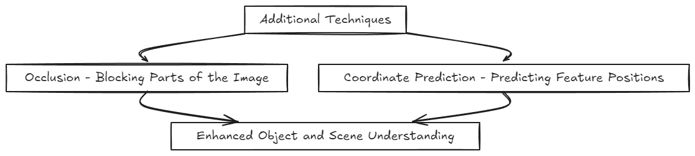

Deep InfoMax (DIM) is an unsupervised learning method that enables models to learn meaningful image features without needing labeled data. DIM achieves this by maximizing mutual information between different parts of an image, helping the model recognize patterns independently. This approach is crucial in fields where labeled data is scarce or costly to obtain, like medical imaging, where expert annotation is often necessary for labeling X-rays or MRIs. By allowing machines to learn directly from raw images, DIM unlocks new possibilities for applications in healthcare, autonomous driving, security, and beyond, enhancing efficiency and accessibility across critical domains.

DIM was first introduced by a team of researchers at Microsoft Research, including Devon Hjelm and Alex, in their 2018 paper titled [Learning Deep Representations by Mutual Information Estimation and Maximization](https://arxiv.org/pdf/1808.06670). This unsupervised learning approach allows machines to extract valuable features directly from images, opening up new opportunities for applications in areas where labeled data is scarce or expensive.

## Step-by-Step Guide to Understanding Deep InfoMax

In this section, we will explore DIM works through a step-by-step guide. Each step will simplify the concepts behind DIM, making it easier to understand its functionality and importance in unsupervised image learning.

### Step 1: The Big Idea – Mutual Information

To understand DIM, let’s start with its core concept: **Mutual Information (MI)**. Think of MI as a measure of how well two parts of an image “understand” each other:

1. Imagine you have an image broken down into small patches (like puzzle pieces).
2. If one patch of the image knows what another patch looks like, they have **high MI**.
3. DIM’s goal is to increase the MI between different parts of the image to learn meaningful connections across the image as a whole.

In simple terms, the more two parts of an image are connected in what they show, the higher the MI. By maximizing MI, DIM encourages the model to recognize related features, even without any labels.

### Step 2: Breaking Down the Image into Local and Global Features

DIM has a clever approach to learning images:

- **Local Features**: Small details or features within different parts of the image (like the texture on a tree or the shape of an eye).
- **Global Features**: The bigger picture or summary of the whole image (for example, understanding the entire tree or the whole face).

DIM encourages the model to maximize MI between these local and global features. This setup helps the model understand how each small part of an image contributes to the larger scene.

### Step 3: Training the Model with Loss Functions

In machine learning, a loss function tells the model how well it’s performing and guides it to improve. DIM uses several types of loss functions to train the model, with **InfoNCE loss** being the most effective:

- **InfoNCE Loss**: Encourages the model to correctly match local and global features. InfoNCE ensures that parts of the image fit together, almost like solving a puzzle.
- **Other Loss Functions** (e.g., JSD and DV): These also contribute to training, but InfoNCE has shown to work best for DIM, providing the model with a strong ability to recognize patterns.

By maximizing MI with these losses, DIM learns to identify patterns and structures in images without needing labeled data.

### Step 4: Choosing the Best DIM Configuration

DIM provides several ways to combine local and global information:

- **Global-only DIM (DIM(G))**: Focuses only on global features. This method alone isn’t as powerful as it misses the fine details.
- **Local-only DIM (DIM(L))**: Focuses on local features. This method is quite powerful because it captures important details and often outperforms other unsupervised methods.
- **Local and Global Combined (DIM(L+G))**: Combines both, which can sometimes yield the best results by balancing detail with a broader understanding of the image.

Typically, **DIM(L)** with **InfoNCE loss** (just using local features) performs best, capturing fine details without needing a global summary.

### Step 5: Extra Tricks for Smarter Learning

To make DIM learn even better, the authors added some extra tricks:

- **Occlusion**: In real-world situations, objects are often partially hidden (think of a face with sunglasses). Occlusion encourages the model to recognize the overall image even if parts are blocked. In DIM, the model learns to keep track of the whole image by blocking small patches and then checking if the rest still “fits together” in MI terms.

- **Coordinate Prediction**: DIM also learns the position of local features within an image. By predicting where each part belongs, DIM improves its spatial understanding. For example, it might learn that a feature resembling an eye is usually near the top of a face.

These two tricks help DIM understand objects and scenes in a way that’s spatially aware, meaning it understands where features are relative to each other.

### Step 6: Comparing DIM with Other Methods

DIM was compared to popular unsupervised methods, such as:

- **Variational Autoencoders (VAE)**: Known for generating images, but not as effective in extracting meaningful features for complex image understanding.

- **Contrastive Predictive Coding (CPC)**: Another advanced unsupervised method that learns by predicting future data points within sequences, but DIM performed similarly or even better on some tasks.

Overall, DIM outperformed many methods in unsupervised feature extraction, which is key to understanding images without labels.

### Step 7: Practical Applications of DIM

The ability to learn without labels opens up many possibilities for DIM:

- **Medical Imaging**: In cases where labeling is expensive, DIM can help machines learn features in X-rays or MRIs.

- **Autonomous Driving**: DIM can recognize structures and objects on the road without relying heavily on labeled training data.

- **Surveillance and Security**: DIM can identify patterns in footage without needing extensive labeling.

### A Model That “Sees” Without Labels

DIM is a big step forward in unsupervised learning. By maximizing mutual information between different parts of an image, DIM learns to “understand” images without labels. The local-global approach, combined with the tricks of occlusion and coordinate prediction, makes DIM especially powerful for extracting meaningful information.

With DIM, we get closer to the goal of creating truly intelligent systems that can learn from raw, unlabeled data, just like how humans make sense of the world around us.

