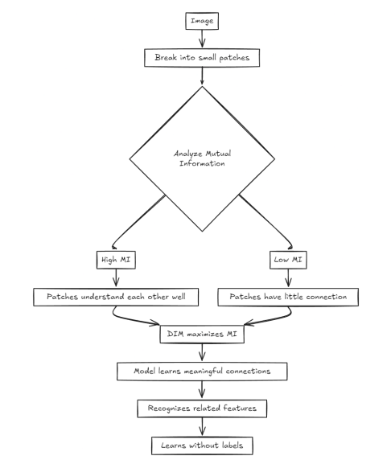

## Introduction to Deep InfoMax (DIM)

**Deep InfoMax (DIM)** is a powerful unsupervised learning method that enables models to capture meaningful image features without relying on labeled data. DIM achieves this by maximizing *mutual information* (MI) between different parts of an image, enhancing the model’s ability to recognize patterns autonomously.

This approach proves crucial in fields where labeled data is scarce or expensive to obtain. For example, in medical imaging, where expert annotation is often required for X-rays or MRIs, DIM opens doors for more accessible analysis by enabling machines to learn directly from raw images.

DIM was introduced by researchers at Microsoft Research, including Devon Hjelm, in their influential 2018 paper, [Learning Deep Representations by Mutual Information Estimation and Maximization](https://arxiv.org/pdf/1808.06670). This unsupervised approach allows for efficient feature extraction, making it suitable for applications in healthcare, autonomous driving, security, and more.

---

## Step-by-Step Guide to Understanding Deep InfoMax

Here, we explore how DIM functions, breaking down its core steps to make it easier to understand the role of mutual information and its unique components in unsupervised image learning.

### Step 1: The Core Concept – Mutual Information (MI)

At the heart of DIM lies **Mutual Information (MI)**. Imagine MI as a measure of understanding between different sections of an image:

- Picture an image divided into smaller patches, almost like pieces of a puzzle. When one patch of the image is able to “understand” or predict another, their MI is considered high.
- DIM’s primary aim is to increase the MI between these patches, thus helping the model uncover meaningful patterns that exist across the entire image.

By maximizing MI, DIM encourages the model to discover these connections, even without the guidance of labeled data, as shown below.

---

### Step 2: Distinguishing Local and Global Features

DIM adopts a dual perspective by focusing on both **local** and **global** features, allowing the model to gain a comprehensive view of the image:

1. **Local features** capture fine-grained details, such as textures and small shapes within the image.
2. **Global features** provide a broader understanding, interpreting the general scene or object structure in its entirety.

This combination lets DIM understand how each small part contributes to the larger image context.

---

### Step 3: Optimizing Learning with Loss Functions

DIM employs several loss functions to help the model measure and improve its performance, with **InfoNCE loss** leading the way:

- The InfoNCE loss encourages accurate alignment of local and global features, somewhat like aligning the pieces of a puzzle.
- Alongside InfoNCE, DIM also uses additional loss functions (like JSD and DV), but InfoNCE has proven most effective, providing the model with a strong basis for pattern recognition.

Through these losses, DIM maximizes MI, ultimately helping the model identify intricate structures within images.

---

### Step 4: Selecting the Ideal DIM Configuration

DIM offers three primary configurations for processing local and global information, each providing unique benefits:

- **Global-only DIM (DIM(G))** focuses on the broader image but may miss finer details.
- **Local-only DIM (DIM(L))** emphasizes fine details, often outperforming other unsupervised models.
- **Combined DIM(L+G)** balances both detail and global understanding, which can enhance results by providing context and precision.

While DIM(L) paired with InfoNCE loss generally offers the best performance, DIM(L+G) sometimes achieves balanced results by combining detail with a global perspective.

---

### Step 5: Enhancing Learning with Occlusion and Coordinate Prediction

To further improve DIM’s performance, researchers introduced additional techniques:

**Occlusion:** 
   - By hiding parts of an image, DIM learns to fill in the gaps, enhancing the model’s ability to recognize objects even when partially obscured. This technique is crucial in real-world scenarios, such as recognizing faces in images where sunglasses or hats may partially block features.

**Coordinate Prediction:** 
   - DIM enhances spatial awareness by learning where each part of an image belongs. For instance, it can understand that an eye feature should appear in the upper region of a face, further improving image interpretation.

These added techniques equip DIM with a spatial understanding, enabling it to maintain object positions and relative distances within the image.

---

### Step 6: Evaluating DIM Against Other Methods

When compared with other unsupervised methods, DIM has shown distinct advantages:

- **Variational Autoencoders (VAEs):** While VAEs are known for image generation, they often fall short in extracting meaningful features for complex images.
- **Contrastive Predictive Coding (CPC):** CPC excels in sequence-based prediction but can be outmatched by DIM in certain feature extraction tasks.

DIM’s innovative approach has often outperformed these methods, proving itself particularly capable in unsupervised feature extraction—a key advantage for interpreting images without labels.

---

### Step 7: Practical Applications of DIM

DIM’s ability to learn without labeled data unlocks potential applications across several fields:

- **Medical Imaging** – where data labeling is time-consuming and costly, DIM can help models recognize features in X-rays or MRIs without expert annotation.
- **Autonomous Driving** – enabling the model to recognize road signs, lanes, and other patterns without exhaustive labeled datasets.
- **Security and Surveillance** – offering enhanced pattern recognition in video feeds without relying on labor-intensive labeling.

---

## A Model That “Sees” Without Labels

DIM represents a significant step forward in unsupervised learning. By maximizing mutual information across image parts, DIM extracts deep image insights independently. Its combination of local-global understanding and strategies like occlusion and coordinate prediction makes DIM especially adept at capturing nuanced information.

As DIM progresses, it brings us closer to building truly intelligent systems that can learn from raw data, echoing the way humans perceive the world. DIM’s advancement highlights an exciting frontier in AI, unlocking new possibilities for data-scarce fields, and paving the way for more adaptable, accessible AI applications.
